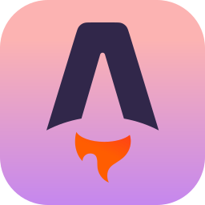
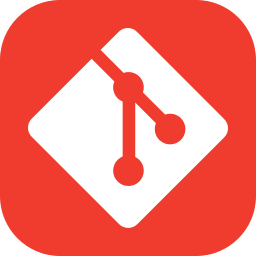
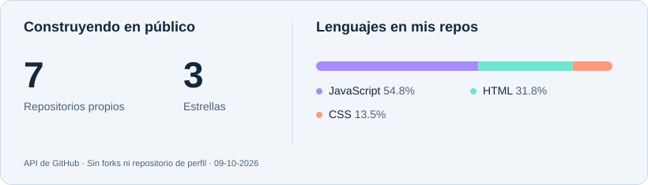

<p align="center">
  <a href="https://benjagc.github.io/Portafolio/">
    
  </a>
</p>

<h1 align="center">Hola, soy Benjamín 👋</h1>

<p align="center">
  Estudiante de Ingeniería en Informática en la <b>Universidad Andrés Bello</b>.<br />
  Diseño y desarrollo sitios web para negocios locales y proyectos propios.
</p>

<p align="center">
  <a href="https://benjagc.github.io/Portafolio/"></a>
  &nbsp;
  <a href="https://www.linkedin.com/in/benjam%C3%ADn-gonz%C3%A1lez-b456b5259/"></a>
  &nbsp;
  <a href="mailto:gonzalezbenjamin530@gmail.com"></a>
</p>

### Un poco de mí

Me interesa unir diseño y código: que una interfaz se vea bien, se entienda y ayude a hacer algo concreto. En mis proyectos puedes encontrar desde contenido editorial hasta interfaces de tiendas y herramientas para explorar IA.

```js
const benjamin = {
  enfoque: ["Diseño web", "Desarrollo frontend", "Experiencias claras"],
  proyectoPropio: "Veredicto IA",
  construyendo: "Sitios con identidad y atención al detalle",
  conversemos: "¿Qué tienes en mente?"
};
```

### Lenguajes y herramientas

<p>
  &nbsp;
  &nbsp;
  &nbsp;
  &nbsp;
  &nbsp;
  &nbsp;
  &nbsp;
  
</p>

**Web:** HTML · CSS · JavaScript · Astro  
**También trabajo con:** Python · C#  
**Publicación:** GitHub Pages · Cloudflare Pages

### Proyectos que puedes explorar

| Proyecto | Qué encontrarás | Enlaces |
| :--- | :--- | :--- |
| **Veredicto IA** | Mi plataforma para descubrir y comparar herramientas de inteligencia artificial. | [Visitar](https://www.veredicto-ia.com/) |
| **Iguana Journal** | Un sitio educativo con dirección editorial, fotografía e interacción. | [Visitar](https://benjagc.github.io/IGUANA-JOURNALCL/) · [Código](https://github.com/BenjaGC/IGUANA-JOURNALCL) |
| **TecnoCommerce** | Demo de tienda de hardware: catálogo, productos y carrito. | [Visitar](https://benjagc.github.io/tecnocommercee/index.html) · [Código](https://github.com/BenjaGC/tecnocommercee) |

En mi [portfolio](https://benjagc.github.io/Portafolio/) cuento las decisiones detrás de cada proyecto y los servicios que ofrezco.

### Mi actividad en GitHub

<picture>
  <source media="(prefers-color-scheme: dark)" srcset="assets/stats-dark.svg" />
  
</picture>

<picture>
  <source media="(prefers-reduced-motion: reduce) and (prefers-color-scheme: dark)" srcset="assets/activity-static-dark.svg" />
  <source media="(prefers-reduced-motion: reduce)" srcset="assets/activity-static.svg" />
  <source media="(prefers-color-scheme: dark)" srcset="assets/github-snake-dark.svg" />
  
</picture>

<p align="center"><a href="https://raw.githubusercontent.com/BenjaGC/BenjaGC/main/assets/github-snake-dark.svg">Ver el recorrido animado</a></p>

<sub>Datos públicos actualizados diariamente. Los lenguajes se calculan por tamaño de código en repositorios propios, sin forks ni este perfil.</sub>

---

<p align="center">
  <b>¿Tienes una idea para tu web?</b><br />
  <a href="mailto:gonzalezbenjamin530@gmail.com">Conversemos</a> · <a href="https://benjagc.github.io/Portafolio/">De idea a sitio</a>
</p>
